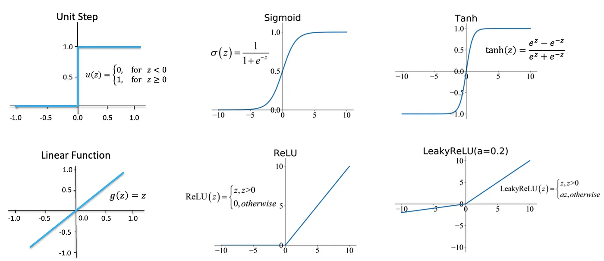
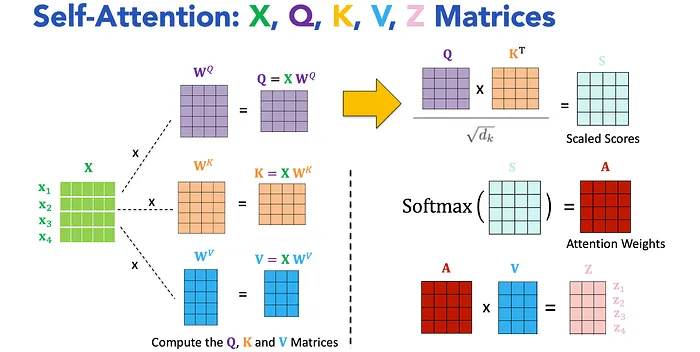

# The module we must use in ML/DL

## Model (Predictive Mapping)
a function that maps input data to output predictions. In machine learning, models are trained on data to learn this mapping.

## Activation Functions

there are six main activation functions used in deep learning:
1. ReLU (Rectified Linear Unit)
2. Leaky ReLU
3. Sigmoid
4. Tanh
5. Linear Function
6. Unit Step

the most commonly used activation function is ReLU, which is defined as:
$$
f(x) = max(0, x)
$$
based on ReLU,, Parametric ReLU (PReLU, 2015) is a generalization of ReLU that allows a small, learnable slope for negative inputs. It is defined as:
$$
f(x) = \begin{cases}
x, & \text{if } x > 0 \\
\alpha x, & \text{if } x \leq 0
\end{cases}
$$
and the modification, like Exponential Linear Unit (ELU, 2016), is defined as:
$$
f(x) = \begin{cases}
x, & \text{if } x > 0 \\
\alpha (e^x - 1), & \text{if } x \leq 0
\end{cases}
$$
etc ...

someone also regard Softmax as an activation function, which is defined as:
$$
f(x_i) = \frac{e^{x_i}}{\sum_{j=1}^{K} e^{x_j}}
$$    

## Loss Function (Per-Sample Error)

Measures the discrepancy between a single model prediction $\hat{y}$ and its true target label $y$.

For continuous regression targets, a common measure is Square Loss: $\text{Loss} = (\hat{y} - y)^2$.

>> Loss function select guide
- Regression: Mean Squared Error (MSE): average of squared differences between predicted and actual values, sensitive to outliers; Mean Absolute Error (MAE): average of absolute differences, more robust to outliers.
- Classification: Cross-Entropy Loss: measures the difference between predicted probability distribution and true distribution; BCE (Binary Cross-Entropy, only accept 2 classes): for binary classification; CCE (Categorical Cross-Entropy): for multi-class classification.
>> Key Insight: The right loss function ensures your model optimizes for the right objective.

## Objective Function (Global Goal) (Broadest)

- Defines the overall goal of the learning task (e.g., minimize error, maximize reward,
incorporate regularization).
- Guides the model to learn effectively from data

Aggregates individual loss values across training samples to form a single scalar value that defines training performance.

For example, Mean Squared Error ($\text{MSE}$) averages square losses across a dataset of size $N$:

$$\text{MSE} = \frac{1}{N} \sum_{i=1}^{N} (\hat{y}_i - y_i)^2$$

The learning objective is to adjust model parameters to make this value as close to zero as possible.

## optimization algorithms

1. Stochastic Gradient Descent (SGD)
   Update Strategy: Update weights after each individual sample using its sample loss $L_i(\theta)$.When to use: Great for online learning, streaming data, or escaping local minima due to the noise in updates.
2. Batch Gradient Descent
   Update Strategy: Pass the entire dataset, compute the total dataset cost function $J(\theta)$, and make one update per epoch.When to use: Small datasets that easily fit in memory where stable, smooth convergence is preferred.
3. Mini-Batch Gradient Descent (Industry Standard)
   Update Strategy: Pass a small chunk of data (e.g., 32, 64, or 128 samples), compute the batch cost function, and update weights after each batch.When to use: Modern deep learning. It combines the speed and noise reduction of SGD with the hardware acceleration (GPU vectorization) of batch updates.

